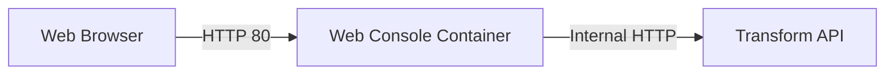
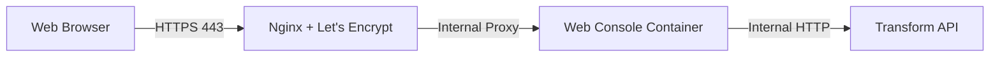

# Web Console Component Specification

## Overview
The **Web Console** is the primary user interface for consuming Telegram channel summaries. It is a lightweight Single Page Application (SPA) that interacts with the **Transform** component to fetch and display summaries.

## Core Functionality
*   **Summary Retrieval**: Users can trigger summary generation for a specific channel.
*   **Message ID Tracking**: Users can specify a `last_message_id`. This ID is persisted in the browser's local storage and suggested as the default for subsequent calls.
*   **Markdown Rendering**: Summaries returned by the Transform component in Markdown format are converted to HTML for a premium reading experience.
*   **Responsive Design**: The interface is optimized for both desktop and mobile viewing.

## Architecture

### Component Structure
The Web Console consists of two sub-layers:
1.  **Frontend (SPA)**: A React-based application.
2.  **API Gateway (Proxy)**: A lightweight backend service that proxies requests from the frontend to the internal Transform API.

### Network Flow

#### Local Development

#### Production (Planned)

## Technical Stack
*   **Frontend**: React (Minimal installation), `lucide-react` for icons, `react-markdown` for rendering.
*   **Backend Proxy**: FastAPI (Python), serving static files and proxying `/api` requests.
*   **Styling**: Vanilla CSS (Premium, dark-mode first design).

## Interface Definition

### Frontend State
*   `channel_id`: Selected Telegram channel.
*   `last_message_id`: Stored in `localStorage`.
*   `summary_html`: The rendered output.

### Proxy API (Internal)
*   `GET /api/summarize`: Proxies to `http://transform:8000/summarize` with all query parameters.

## User Experience (UX)
1.  Select channel from a predefined list (loaded from shared `config.json`).
2.  Adjust `last_message_id` (defaults to last used).
3.  Click "Summarize".
4.  View rendered summary with clickable links (opens in a new tab).
5.  Metadata (total messages, processed) is displayed in a subtle header/sidebar.

## Deployment
*   **Containerization**: Single Docker image containing both the React build (static) and the FastAPI proxy.
*   **Health Check**: Basic `/health` endpoint.
